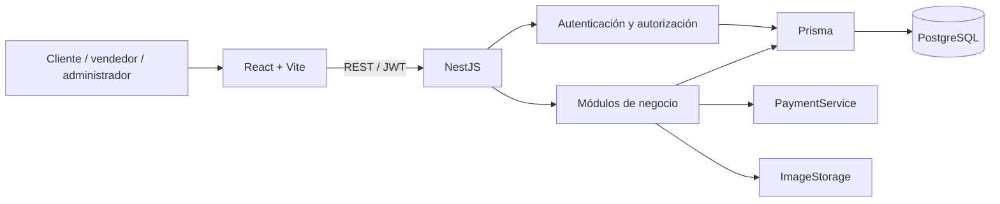

# Arquitectura propuesta

## Visión general

Un monolito modular NestJS atiende una SPA React a través de REST. PostgreSQL es la fuente de
verdad de usuarios, catálogo, pedidos e inventario. Prisma reside exclusivamente en el backend.
Separar frontend y backend permite desplegarlos independientemente sin acoplar sus dependencias.

## Organización

Frontend: `components`, `pages`, `layouts`, `services`, `hooks`, `store`, `types`, `schemas`,
`utils` y `routes`. TanStack Query administra datos remotos; Zustand conserva estado global pequeño.
React Hook Form y Zod validan formularios. El backend vuelve a validar todas las entradas.

Backend: módulos previstos `auth`, `users`, `businesses`, `products`, `categories`, `carts`, `orders`,
`inventory` y `admin`, junto a `common` y `config`. Cada módulo añadirá sus controllers, services y DTO
al implementarse. Controllers coordinan HTTP; services aplican reglas; Prisma maneja persistencia.
No se añadirán repositorios que simplemente dupliquen todos los métodos de Prisma.
Reseñas, promociones y notificaciones se agregarán posteriormente como módulos independientes.

## Flujo principal

1. Un usuario se registra como cliente o vendedor; el registro público nunca concede ADMIN.
2. Un vendedor crea su tienda en PENDING. Solo una tienda ACTIVE puede vender públicamente.
3. ADMIN aprueba o rechaza tiendas. SELLER administra exclusivamente su tienda.
4. CUSTOMER explora un catálogo paginado y agrega cantidades válidas al carrito.
5. Checkout recibe dirección y método de pago, y vuelve a leer productos y precios desde la BD.
6. Una transacción crea Order, SellerOrder por tienda y los OrderItem correspondientes.
7. Cada vendedor confirma su subpedido: se valida y descuenta inventario de forma atómica.
8. El vendedor avanza estados permitidos; el cliente consulta la compra y todos sus subpedidos.

## Entidades conceptuales

El [modelo entidad-relación](data-model.md) detalla las decisiones de la fase 3 y su correspondencia
con el esquema Prisma y las restricciones SQL.

| Entidad            | Responsabilidad y relación principal                         |
| ------------------ | ------------------------------------------------------------ |
| User / Role        | Identidad y uno de tres roles iniciales; Role puede ser enum |
| Business           | Tienda de un propietario; ownerId único en el MVP            |
| Category           | Categoría global; parentId opcional para jerarquías futuras  |
| Product            | Producto de una tienda, categoría, precio y existencias      |
| ProductImage       | Imágenes ordenadas del producto                              |
| Cart / CartItem    | Carrito de cliente; una línea por producto                   |
| Order              | Compra global, cliente, dirección y total                    |
| SellerOrder        | Parte de la compra correspondiente a un negocio              |
| OrderItem          | Producto y valores históricos de la compra                   |
| Address            | Dirección guardada de usuario                                |
| InventoryMovement  | Entrada, salida o ajuste con stock anterior y posterior      |
| RefreshToken       | Sesión revocable con hash, expiración y familia de rotación  |
| OrderStatusHistory | Historial por subpedido, actor, fecha y transición           |

## Decisiones de consistencia y seguridad

- IDs opacos y slugs únicos; los IDs no sustituyen las verificaciones de autorización.
- Cada operación de vendedor aplica filtros de propiedad desde su identidad autenticada.
  No se acepta el businessId del cliente como prueba de pertenencia.
- Precios en decimal de precisión fija; moneda inicial GTQ. Las operaciones de dinero no deben
  depender de aritmética binaria de punto flotante. Se transportarán valores decimales explícitos.
- OrderItem conserva nombre, SKU y precio unitario; Order conserva una copia de la dirección.
  Editar un producto o una dirección guardada no altera compras históricas.
- PENDING no reserva existencias. CONFIRMED descuenta stock por subpedido con actualización
  condicional y transacción; si falta inventario, no se confirma parcialmente ese subpedido.
  Un carrito o pedido pendiente no garantiza disponibilidad hasta la confirmación.
- Se permiten PENDING → CONFIRMED → PREPARING → SHIPPED → DELIVERED. La cancelación será
  posible desde PENDING, CONFIRMED o PREPARING según actor; no desde SHIPPED ni DELIVERED.
  Solo se restaura stock previamente descontado, una vez, en la misma transacción.
- Estado global de Order se deriva de los subpedidos; una compra puede tener estados mixtos.
  No se usa un estado global para sobrescribir decisiones de distintos vendedores.
- Contraseñas bcrypt y refresh tokens con hash. Access JWT breve, refresh HttpOnly, rotación,
  revocación y protección mediante encabezado personalizado y origen.
- El cierre de sesión revoca la familia renovable. El guard JWT consulta usuario y familia activos
  en PostgreSQL en cada petición: logout, reutilización e inactivación deniegan el siguiente acceso.
  La rotación conserva el vencimiento absoluto; el frontend deberá coordinar una renovación
  en vuelo para evitar que peticiones simultáneas provoquen detección de reutilización.
- Validación DTO, CORS explícito, Helmet, límites de solicitudes y errores sin detalles internos.
- Se planifica pago contra entrega y simulado; no se almacenan números de tarjetas.
  PaymentService permitirá proveedores futuros. ImageStorage permitirá almacenamiento local o remoto
  con validación de formato, tamaño y cantidad durante la implementación.

## API y experiencias

Base prevista: `/api/v1`. Recursos públicos de catálogo; `/auth`, `/cart`, `/orders`,
`/seller` y `/admin` para flujos específicos. Swagger documentará los contratos implementados.
Paginación y filtros se ejecutan en backend. Los datos de dashboards se calculan dentro de su ámbito.

Marketplace público comercial y visual; dashboard vendedor orientado a operaciones; dashboard
administrativo orientado a control. Diseño mobile-first, componentes reutilizables y estados
de carga, error, vacío y confirmación. Las rutas protegidas de React complementan los guards del backend.

## Estado de implementación

Frontend conserva su estructura inicial. Backend tiene Prisma, API NestJS, herramientas de datos
y pruebas de integración; su tsconfig extiende `tsconfig.base.json`.
La fase 2 añade un contenedor PostgreSQL 17, volumen persistente, healthcheck y comprobación SQL.
La fase 3 añade el esquema Prisma, migración inicial con restricciones SQL y seed de categorías.
La fase 4 añade AppModule, DatabaseModule y HealthModule; configuración validada, errores HTTP,
ValidationPipe, CORS, Helmet y Swagger. La inyección de Prisma controla su ciclo de vida.
La fase 5 añade AuthModule y UsersModule: registro, login, JWT/Passport, refresh rotativos,
logout y perfil autenticado. Sus contratos y decisiones se detallan en [auth.md](auth.md).
La fase 6 añade guards globales de JWT y roles, excepciones públicas explícitas, filtros Prisma
de propiedad, límites de solicitudes y de tamaño JSON. El rol y la sesión se consultan en BD.
La fase 7 añade BusinessesModule: creación, consulta y edición de la tienda propia con filtros
de propietario dentro de las consultas, además de lista pública paginada y detalle por slug.
La consulta pública exige tienda ACTIVE y propietario SELLER activo; usa una proyección explícita.
Los demás módulos comerciales y las interfaces de marketplace siguen pendientes.
Consulta [negocios](businesses.md) para contratos, visibilidad y pruebas reales del módulo.
La fase 8 añade CategoriesModule: administración global exclusiva de ADMIN y consulta pública
paginada de categorías activas. Desactivar conserva referencias; el seed no sobrescribe ediciones.
La API mantiene categorías planas y reserva parentId para subcategorías posteriores.
Consulta [categorías](categories.md) para contratos y pruebas del módulo.
Consulta [seguridad](security.md) para la política de roles, propiedad y cuotas por IP.
Consulta [la guía del backend](backend.md) para iniciar y comprobar la API.
Consulta [la guía de base de datos](database.md) para operar el entorno.
