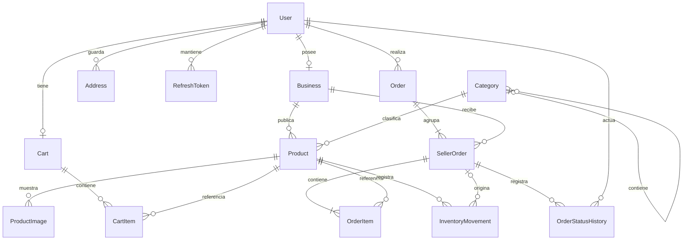

# Modelo de datos de PatziShop

Propuesta presentada antes de crear el esquema de la fase 3. PostgreSQL aplica claves foráneas,
unicidad y restricciones básicas; los servicios de las siguientes fases aplicarán autorización,
transiciones y operaciones transaccionales. La existencia de tablas no implementa esos flujos.

## Relaciones

Las cardinalidades mínimas de un subpedido por compra y un ítem por subpedido son reglas
transaccionales del futuro servicio: una clave foránea no obliga al padre a tener hijos.

## Entidades y decisiones

| Entidad            | Decisiones principales                                                                  |
| ------------------ | --------------------------------------------------------------------------------------- |
| User               | UUID, email único, nombre, hash de contraseña, rol y activación                         |
| Business           | Propietario único, slug único, contacto, imágenes y estado de aprobación                |
| Category           | Slug único, activación y padre opcional; no permite ser su propio padre                 |
| Product            | Tienda obligatoria, categoría, SKU único por tienda, slug único, precio, stock y estado |
| ProductImage       | URL y orden de visualización únicos por producto                                        |
| Cart               | Uno por usuario; sus precios se consultan desde Product                                 |
| CartItem           | Una línea por producto con cantidad positiva                                            |
| Address            | Datos de entrega guardados de un usuario                                                |
| Order              | Número secuencial público, cliente, total, moneda, método de pago y dirección copiada   |
| SellerOrder        | Uno por tienda y compra; subtotal, estado y marcas de descuento/restauración de stock   |
| OrderItem          | Producto, negocio y subpedido compatibles; nombre, SKU y precio históricos              |
| OrderStatusHistory | Estado anterior opcional, nuevo estado, actor y fecha                                   |
| InventoryMovement  | Producto, negocio, subpedido opcional, tipo, cambio con signo y saldos                  |
| RefreshToken       | Hash único, familia UUID, expiración, revocación y reemplazo opcional                   |

Role es un enum con ADMIN, SELLER y CUSTOMER: no se añade una tabla editable de permisos
para tres roles fijos. Cambiar a múltiples roles por usuario será una migración explícita.
Los roles de propietarios y compradores se validarán en servicios, no se deducen de relaciones.
UUIDs no sustituyen el control de propiedad.

## Dinero y snapshots

Precio unitario: `Decimal(12,2)`. Totales: `Decimal(14,2)`. Moneda inicial GTQ.
Los clientes recibirán valores monetarios como cadenas decimales para evitar redondeo binario.
OrderItem conserva nombre, SKU, precio unitario y total de línea; SQL comprueba que el total
de línea corresponde a cantidad × precio. Order conserva nombre, dirección, teléfono e instrucciones
de entrega, independientemente de cambios en Address.

Los totales agregados entre filas se calcularán y comprobarán desde servicios transaccionales;
no se añade un trigger que compita con esas reglas. No se guarda precio en CartItem.
El número público de pedido es secuencial y puede tener huecos; no es un mecanismo de autorización.

## Aislamiento por negocio

Product y SellerOrder tienen claves únicas compuestas `(id, businessId)`.
OrderItem contiene businessId y referencia ambas claves compuestas: PostgreSQL rechaza
un producto de una tienda diferente al negocio del subpedido. InventoryMovement utiliza
el mismo patrón si se asocia a un subpedido. Cada compra tiene un SellerOrder por businessId.
Los servicios también deben filtrar datos por el negocio autenticado; estas claves no son RBAC ni RLS.

## Inventario y cancelaciones

Stock nunca negativo. InventoryMovement.quantity es una variación con signo: IN positiva,
OUT negativa y ADJUSTMENT positiva o negativa, siempre distinta de cero.
SQL comprueba `previousStock + quantity = newStock` y que ambos saldos sean no negativos.
La concordancia con el stock actual del producto y la inserción del movimiento será responsabilidad
de una transacción que se implementará en el servicio de inventario.

SellerOrder guarda stockDeductedAt y stockRestoredAt; no puede restaurarse sin haber descontado.
Estas marcas apoyan la idempotencia futura; no ejecutan ajustes automáticamente.
El estado global de Order se deriva de sus subpedidos y no se guarda como valor duplicado.
Las transiciones y la restauración única se implementarán en la fase de órdenes.

## Restricciones, eliminación e índices

- Email normalizado en minúsculas sin espacios externos, unicidad y validación básica no vacío.
  La validación completa de formato llegará con los DTO.
- Stock y precios no negativos; cantidades de carrito y pedido positivas.
- Restricciones CHECK adicionales se mantienen explícitamente en la migración SQL porque
  Prisma Schema no representa todas ellas. No borrarlas al generar nuevas migraciones.
- Se restringe eliminar usuarios, tiendas, categorías o productos con referencias históricas.
  La operación comercial será desactivación; compras e inventario no se borran por cascada.
- Carrito y líneas, imágenes y sesiones son datos operativos que sí permiten cascadas pertinentes.
- Índices por estado, fecha, propietario, categoría, negocio y cliente apoyan las consultas previstas.
  El buscador avanzado y sus índices se ajustarán al implementar el catálogo.
- Una categoría no puede referenciarse a sí misma; ciclos entre varios padres se validarán en el servicio.

## Seed inicial

El seed asegura las ocho categorías globales del MVP por slug sin borrar datos. Desde la fase 8
crea solo las faltantes y conserva los cambios administrativos de registros existentes.
No crea credenciales ni pedidos ficticios antes de implementar reglas de autenticación y órdenes.
El seed completo de administrador, vendedores, tiendas, productos, clientes y pedidos se ampliará
cuando esos servicios existan. El seed no debe ejecutarse automáticamente al aplicar migraciones.
